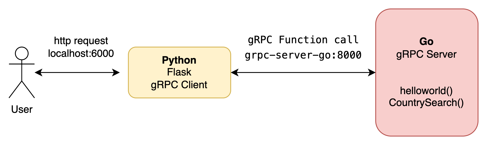

<p align="center" >

</p>

## gRPC with Golang and Python



This is a example of calling functions implemented in golang in python using gRPC.

There are two containers, gRPC server container and gRPC client container respectively.

I implemented the restcontries(https://restcountries.com/) function introduced as an example in some blogs and the helloword function posted in the gRPC official documentation.

## Prerequisites
- Docker 20.10.12
- docker compose 1.29.2
- VScode (for devcontainer)
  - Remote - Containers Extension(ms-vscode-remote.remote-containers)
  - Docker Extension(ms-azuretools.vscode-docker)

## Start
### Set up on local
```console
// clone source code
> git clone https://github.com/deagwon97/grpc-go-python.git

// create a docker network for comunication between containers.
> sh create-network.sh
```
### Run gRPC Server in DevContainers
1. Open command palette
2. select "> remote-containers: open Folder in container.."
3. select "grpc-go-python/server-go" directory
4. run server in server-go container
```console
// change directory
# cd ./src

// Create go grpc file from common proto file.
# sh gen_proto_code.sh

// run server
# go run .
```
### Run gRPC Client in DevContainers
1. Open New VScode window
2. Open command palette
3. select "> remote-containers: open Folder in container.."
4. select "grpc-go-python/client-python" directory
5. run server in client-python container
```console
// change directory
# cd ./src

// Create python grpc file from common proto file.
# sh gen_proto_code.sh

// run client server
# python3 app.py
```

## Test
1. test countries.proto
```console
> curl localhost:6000/countries/korea
{"alpha2Code":"KP","capital":"Pyongyang","name":"Korea (Democratic People's Republic of)","nativeName":"\ubd81\ud55c","population":25778815,"subregion":"Eastern Asia"}
```
2. test helloworld.proto
```console
> curl localhost:6000/helloworld/deagwon 
{"message":"Hello deagwon"}
```


## Refrence and Source
- https://grpc.io/docs/languages/python/quickstart/
- https://github.com/grpc/grpc-go/tree/master/examples/helloworld
- https://medium.com/@andersonborges_70700/grpc-with-golang-and-python-f5b7aa602d74